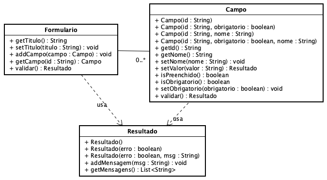

**Universidade Federal da Paraíba - UFPB** \
**Centro de Ciências Exatas e Educação - CCAE** \
**Departamento de Ciências Exatas - DCX**

**Professor:** [Rodrigo Rebouças de Almeida](http://rodrigor.dcx.ufpb.br)

# Atividade

- O `Campo` pode ser obrigatório ou não. Observe o método `isObrigatorio()` e os novos construtores.
- Observer o método `validar()`, nas classes `Campo` e `Formulário`.
- O método `validar()` da classe `Campo` deve retornar um objeto do tipo `Resultado`, que indica se o campo possui algum erro.
- Se um campo for obrigatório e não estiver preenchido, o método `validar()` deve retornar um resultado que representa um erro.
- O `Resultado` é uma classe que armazena o resultado da validação do campo e do formulário. O `Resultado` armazena um `boolean` que indica se ele é um erro ou não. Ele também armazena mensagens, que podem ser mensagens de erro. 
- O método `validar()` em `Formulario` verifica todos os campos e retorna um `Resultado` que indica se houve algum erro. Ele também contém todas as mensagens de todos os campos com erro.

Estude a implementação dos testes para entender os detalhes da implementação.

